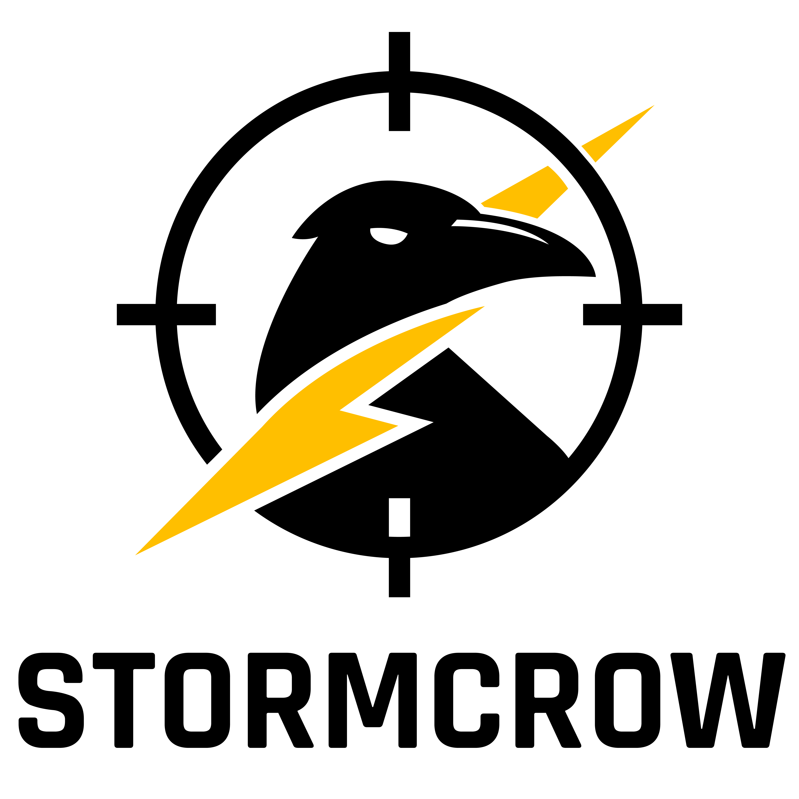

<h1 align="center">
  
</h1>

Stormcrow is a surface meteorological data gathering system for direct-fire munitions testing, automatically detecting and logging round firing events along with environmental conditions.

### Repositories

- **stormcrow_base** — Central control application, GUI, and data persistence layer  
  https://github.com/nate-norris/stormcrow_base

- **stormcrow_weather** — Environmental sensing node reading atmospheric data from the Airmar sensor  
  https://github.com/nate-norris/stormcrow_weather

- **stormcrow_boom** — Acoustic detection node responsible for identifying firing events  
  https://github.com/nate-norris/stormcrow_boom

- **stormcrow_utils** — Shared Rust utilities including radio communication, logging, and common functionality  
  https://github.com/nate-norris/stormcrow_utils

---

# Stormcrow System Architecture

Stormcrow is a distributed event-correlation system composed of multiple cooperating applications.
Independent sensor nodes collect environmental and acoustic data and transmit events over radio to a central control application which provides the user interface, coordinates system behavior, and persists round-associated weather data.

## System Overview

                 ┌──────────────────────┐
                 │   stormcrow_weather  │
                 │     (Rust Service)   │
                 │  Airmar Sensor Node  │
                 └──────────┬───────────┘
                            │
                            │ Radio Messages
                            │
                 ┌──────────▼───────────┐
                 │     stormcrow_base   │
                 │    (Tauri + Rust)    │
                 │  GUI + Coordinator   │
                 │  Data Persistence    │
                 └──────────▲───────────┘
                            │
                            │ Radio Messages
                            │
                 ┌──────────┴───────────┐
                 │    stormcrow_boom    │
                 │     (Rust Service)   │
                 │ Acoustic Detection   │
                 └──────────────────────┘

    Shared Rust Library (used by ALL components)
    ───────────────────────────────────────────
                 stormcrow_utils

## Component Responsibilities

| Component | Technology | Runs Where | Primary Responsibility | Produces | Consumes |
|---|---|---|---|---|---|
| **stormcrow_base** | Tauri (Rust + UI) | Control computer | System coordinator, GUI, round lifecycle management, data persistence | Round records, operator feedback | Weather updates, firing events |
| **stormcrow_weather** | Rust | Sensor node hardware | Reads atmospheric data from Airmar sensor and transmits readings | Weather telemetry | — |
| **stormcrow_boom** | Rust | Acoustic node hardware | Detects firing events via microphone trigger and reports round events | Fire events | — |
| **stormcrow_utils** | Rust crate | Shared dependency | Radio communication, shared protocol types, logging, notifications | Shared infrastructure | Used by all components |

---

## Event Flow

1. `stormcrow_weather` samples atmospheric conditions from the Airmar sensor.
2. Weather data is transmitted via radio to the base node.
3. `stormcrow_base` receives and maintains the latest environmental readings.
4. `stormcrow_boom` detects an acoustic firing event.
5. The firing event is transmitted via radio to the base node.
6. `stormcrow_base` associates the most recent weather data with the detected round.
7. Round and environmental data are persisted to the database and displayed in the GUI.
8. Atmospheric thresholds including maximum cross and head/tail wind relative to gun position are communicated to ensure accurate test samples.

---

## Architectural Notes

- Sensor nodes operate independently and communicate only through radio messages.
- `stormcrow_base` acts as the authoritative system coordinator.
- Shared communication and utility functionality lives in `stormcrow_utils`.
- Rust is used for hardware interaction and communication logic across all services.
- The Tauri application provides the desktop interface layer while delegating system logic to Rust.
- Components are designed to run on dedicated hardware appropriate to their role (Intel Nuk/Raspberry Pi 5).
- Current hardware includes Intel Nuk, Raspberry Pi 5, Freewave MM2T 900 MHz radio, Airmar 1500WXS, RW Electronics Sound Trigger Box